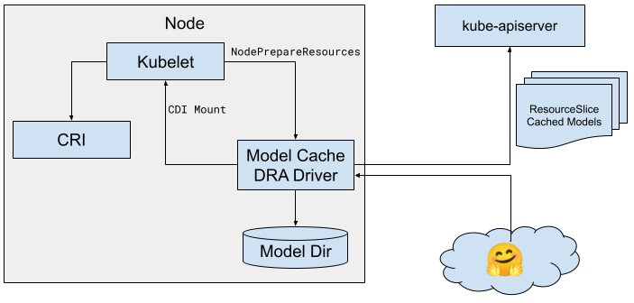

# Node Model Cache

Author: @johnbelamaric

When running inference workloads in vLLM, the model needs to be loaded into the
local GPUs. By default, vLLM downloads models from the Hugging Face Hub, though
it can also use a locally cached model. A locally cached model avoids the
download time, reducing time-to-first token.

This repo contains an on-node model cache, shared between multi-tenant Pods.
This allows common models to be immediately available to vLLM or other serving
tools. DRA provides a convenient way to manage the model cache and share them
between Pods, as well as a way for the scheduler to prefer nodes that already
have the model available.

When a Pod needs a model, it uses a ResourceClaim to ask for that specific
model. A DRA driver manages a model cache on the node, publishing the locally
available models. This allows the ResourceClaim to specify a preference for a
cached model to the scheduler.

The DRA driver advertises the available cached models, as well as a “stub”
model to identify which providers it is able to access.



For example, this ResourceSlice advertises that it has locally cached the
google/gemma-4-31B-it model, and is able to download models from Hugging Face.

```yaml
apiVersion: resource.k8s.io/v1
kind: ResourceSlice
metadata:
  name: model-cache-node-00-slice-00
spec:
  driver: modelcache.x-k8s.io
  pool:
    name: model-cache-node-00
    generation: 1
    resourceSliceCount: 1
  nodeName: model-cache-node-00
  devices:
  - name: model-google-gemma-4-31b-it
    allowMultipleAllocations: true
    attributes:
      id:
        string: google/gemma-4-31B-it
      provider:
        string: huggingface
      cached:
        bool: true
  - name: provider-huggingface
    allowMultipleAllocations: true
    attributes:
      id:
        string: *
      provider:
        string: huggingface
      cached:
        bool: false
```

The driver also defines a couple of device classes, to make the ResourceClaims
a little bit simpler. There is one DeviceClass for cached models, and one for
the stub model.

```yaml
apiVersion: resource.k8s.io/v1
kind: DeviceClass
metadata:
  name: hf.modelcache.x-k8s.io
spec:
  selectors:
  - cel:
      expression: 'device.driver == "modelcache.x-k8s.io"'
  - cel:
      expression: 'device.attributes["modelcache.x-k8s.io"].provider == "huggingface"'
  - cel:
      expression: 'device.attributes["modelcache.x-k8s.io"].id == "*"'
---
apiVersion: resource.k8s.io/v1
kind: DeviceClass
metadata:
  name: cached.modelcache.x-k8s.io
spec:
  selectors:
  - cel:
      expression: 'device.driver == "modelcache.x-k8s.io"'
  - cel:
      expression: 'device.attributes["modelcache.x-k8s.io"].cached == true'
```

To use this, a ResourceClaimTemplate makes use of the `firstAvailable` field
when making the requests for the model. The first option is the cached model;
the second is the model stub with a configuration option identifying the
specific model to use.

```yaml
apiVersion: resource.k8s.io/v1
kind: ResourceClaimTemplate
metadata:
  name: gemma-4-e2b-it-model
spec:
  spec:
    devices:
      requests:
      - name: model
        firstAvailable:
        - name: cached-model
          deviceClassName: cached.modelcache.x-k8s.io
          selectors:
          - cel:
              expression: "device.attributes['modelcache.x-k8s.io'].id == 'google/gemma-4-E2B-it'"
        - name: huggingface-model
          deviceClassName: hf.modelcache.x-k8s.io
      config:
      - requests: ["model"]
        opaque:
          driver: modelcache.x-k8s.io
          parameters:
            apiVersion: modelcache.x-k8s.io/v1
            kind: ModelLoader
            provider: huggingface
            modelId: google/gemma-4-E2B-it
```

When the Pod is scheduled, the scheduler will prefer the first option to
satisfy the claim. If there is no node advertising that model as cached, then
it will choose the second option. The config block tells the cache how to load
the model.


During `NodePrepareResources`, the driver does the following:
- It initiates the model download to a shared host directory that it manages.
- It sets a mount in the CDI file to make the model directory available to the
  container.
- It sets a `MODEL_PATH` environment variable to let the workload know where to
  find the model.
- It sets a `MODEL_NAME` environment variable to the modelId value for use in
  the deployment.
- It sets a `createContainer` hook to have the container runtime wait until the
  model is fully downloaded before creating the container. This is done by
  checking for the presence of a sentinel file.


`NodePrepareResources` will return successfully even while the model is
downloading. This allows the Pod creation to proceed during the download,
making image and model downloads concurrent. The `createContainer` hook ensures
that the container will not start until the model is fully downloaded.

```yaml
apiVersion: apps/v1
kind: Deployment
metadata:
  name: vllm-gemma-4-e2b-it
spec:
  replicas: 1
  selector:
    matchLabels:
      app: vllm-gemma-4-e2b-it
  template:
    metadata:
      labels:
        app: vllm-gemma-4-e2b-it
    spec:
      nodeSelector:
        cloud.google.com/compute-class: vllm-gpu-ccc
      tolerations:
      - key: "nvidia.com/gpu"
        operator: "Exists"
        effect: "NoSchedule"
      resourceClaims:
      - name: gpu
        resourceClaimTemplateName: gemma-4-e2b-it-gpu
      - name: model
        resourceClaimTemplateName: gemma-4-e2b-it-model
      containers:
      - name: vllm-gpu
        image: vllm/vllm-openai:gemma4
        command: ["/bin/bash", "-c"]
        args:
        - "python3 -m vllm.entrypoints.openai.api_server --host=0.0.0.0 --port=8000 --model=${MODEL_PATH} --served-model-name ${MODEL_NAME}"
        ports:
        - containerPort: 8000
        resources:
          claims:
          - name: model
          - name: gpu
        readinessProbe:
          tcpSocket:
            port: 8000
          initialDelaySeconds: 15
          periodSeconds: 10
        volumeMounts:
        - name: dshm
          mountPath: /dev/shm
      volumes:
      - name: dshm
        emptyDir:
          medium: Memory
```

## Caveats

* The UX is not great, but it’s workable. It is awkward to have to specify the
  config option to load the model but not to reuse an already cached one.
  [ClusterResourceClaimTemplate](https://github.com/kubernetes/enhancements/issues/5978)
  would help \- especially if we could parameterize it. But I am skeptical we can
  do the parameterization, particularly of the config block.  

* The optimization does not take effect until the model is fully loaded. That
  is, the cached version of the model does not appear in the ResourceSlice
  until it is fully downloaded. Multiple ResourceClaims that ask for the same
  model are not guaranteed to be satisfied by the currently-being-downloaded
  model. This is a functionally benign race condition.
